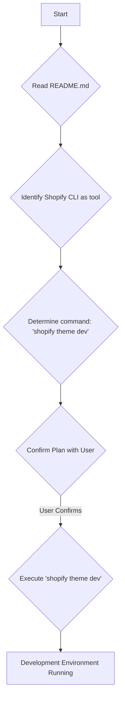

# Development Environment Setup Plan

This document outlines the steps to run the local development environment for the Shopify theme.

## Tool

*   **Shopify CLI:** As recommended in the `README.md`.

## Command

*   `shopify theme dev`

## Steps

1.  Ensure Shopify CLI is installed and you are logged into your Shopify account.
2.  Navigate to the theme's root directory (`d:/programming-realm/projects/shopify-theme/artistic-flavor-theme`) in your terminal.
3.  Execute the command: `shopify theme dev`.
4.  Follow any prompts from Shopify CLI (e.g., selecting a development store).
5.  Shopify CLI will sync the theme and provide a preview URL.

## Workflow Diagram

## Outcome

A local development server will be running, providing a live preview of the theme with features like hot reloading.